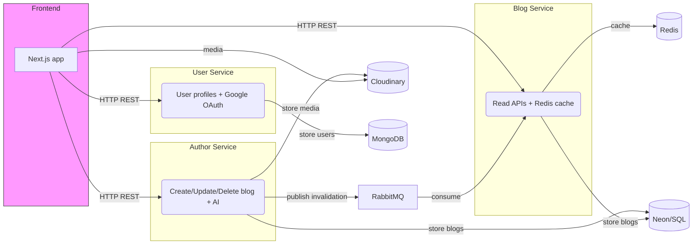

# PostFlow — Microservices Blogging Platform

PostFlow is a production-minded microservices blogging platform built with a Next.js frontend and three TypeScript Node/Express services (Author, Blog, User). The system demonstrates event-driven design (RabbitMQ) for cache invalidation, Redis for fast reads, Cloudinary for media, JWT + Google OAuth for authentication, and Google Generative AI for content polishing. Services are container-friendly (Docker) and intended to be deployable to AWS.

## Why this project stands out
- Event-driven cache invalidation (RabbitMQ) that keeps Redis caches consistent without blocking writes.  
- Multi-datastore architecture: serverless SQL (Neon) for blogs, MongoDB for user profiles, and Redis for caching.  
- Practical ML integration: Google Generative AI used to automatically polish titles, descriptions and blog HTML.  
- Production signals: JWT auth, Cloudinary media storage, Docker-friendly structure and AWS-ready deployment assumptions.

## Tech stack
- Frontend: Next.js (TypeScript), React 19, Tailwind CSS, Jodit rich-text editor
- Backend services: Node.js, Express, TypeScript
- Messaging: RabbitMQ (amqplib)
- Caching: Redis
- Datastores: Neon (serverless SQL) for blogs, MongoDB (Mongoose) for users
- Media: Cloudinary
- Auth: JWT + Google OAuth (googleapis)
- AI: Google Generative AI (Gemini) for content polishing
- Dev / ops: Docker, Docker Compose (recommended), AWS (deployable)

## Architecture (high level)


## Key features
- Authoring: create/edit/delete rich HTML posts (Jodit editor) with Cloudinary image uploads.  
- AI-assisted writing: endpoints that call Google Generative AI to correct titles, descriptions, and blog HTML.  
- Authentication: JWT-based auth for APIs, plus Google OAuth login for users.  
- Caching & consistency: Redis caches read endpoints; cache invalidation jobs are published by the Author service to RabbitMQ and consumed by the Blog service to rebuild caches.  
- Comments & saved posts: comment creation, deletion (owner-only), and save/unsave flows.  

## Important endpoints (examples)
- POST `/api/v1/login` — exchange Google auth code, return JWT and user.  
- POST `/api/v1/blog/new` — (auth) create blog with file upload.  
- GET `/api/v1/blog/all` — list blogs (supports `searchQuery` and `category`).  
- GET `/api/v1/blog/:id` — get single blog (returns blog + author profile).  
- POST `/api/v1/comment/:id` — (auth) add comment.  

## Quick start (recommended: Docker)
Prerequisites: Docker and Docker Compose installed.

1. Create environment files for each service: `services/user/.env`, `services/author/.env`, `services/blog/.env` and `frontend/.env`. Each service expects values such as `PORT`, `JWT_SEC`, `Cloud_Name`, `Cloud_Api_Key`, `Cloud_Api_Secret`, `Rabbimq_Host`, `Rabbimq_Username`, `Rabbimq_Password`, `DB_URL`, `MONGO_URI`, `REDIS_URL`, `Google_Client_id`, `Google_client_secret`, `Gemini_Api_Key`.

2. (Optional) Run with Docker Compose (recommended). If you add a `docker-compose.yml` at the repo root that wires `frontend`, `user`, `author`, `blog`, `redis`, and `rabbitmq`, run:

```powershell
docker compose up --build
```

3. Without Docker (local dev):

```powershell
# Frontend
cd frontend; npm install; npm run dev

# In each service (user/author/blog)
cd services/user; npm install; npm run dev
cd services/author; npm install; npm run dev
cd services/blog; npm install; npm run dev
```

Open the frontend at http://localhost:3000 (or the port set in `frontend/.env`) and follow the login flow.

## How to demo (quick)
1. Login using Google (frontend will obtain an authorization code and send it to the `/login` endpoint).  
2. Create a new blog post with the rich-text editor and upload an image.  
3. Visit the blogs list to see the new post (the Blog service uses Redis cache — if the cache is invalidated an unreadable post may be rebuilt by the consumer).  
4. Show the AI endpoints by asking the editor to polish a title or description (calls to Google Generative AI).


